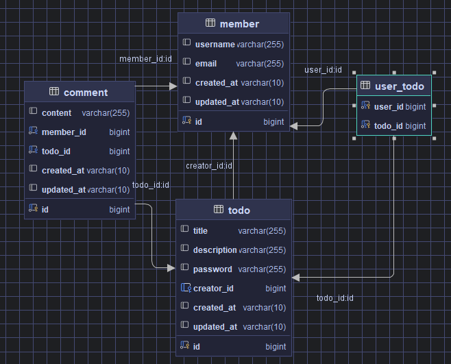

# ERD 설계


# API 명세서

| API 명칭       | 메서드    | 요청 URL             | 요청 헤더                          | 요청 본문                                                                                                              | 응답 코드 | 설명              | 응답 본문                                                                                                                                                |
|--------------|--------|--------------------|--------------------------------|--------------------------------------------------------------------------------------------------------------------|-------|-----------------|------------------------------------------------------------------------------------------------------------------------------------------------------|
| 일정 생성       | POST   | /api/todo          | Content-Type: application/json | ```json {"memberId":1, "title":"할 일 제목","password":"securePassword123","description":"이 할 일에 대한 설명입니다."} ``` | 201   | 일정 생성 성공        | ```json {"id":1,"memberId":1,"title":"할 일 제목","description":"이 할 일에 대한 설명입니다.","createdAt":"2024-10-03", "updatedAt":"2024-10-03"} ``` |
| 전체 일정 조회    | GET    | /api/todo          | Content-Type: application/json | N/A                                                                                                                | 200   | 전체 일정 조회 성공     | ```json [ { "id": 1, "memberId": 1, "title": "할 일 제목", "description": "이 할 일에 대한 설명입니다.", "createdAt": "2024-10-03", "updatedAt": "2024-10-03", "commentCount": 5} ... ] ```  |
| 선택 일정 조회    | GET    | /api/todo/{todoId} | Content-Type: application/json | N/A                                                                                                                | 200   | 선택 일정 조회 성공     | ```json {"id":1,"memberId":1,"title":"할 일 제목","description":"이 할 일에 대한 설명입니다.","createdAt":"2024-10-03", "updatedAt":"2024-10-03", "commentCount": 5} ``` |
| 일정 수정       | PUT    | /api/todo/{todoId} | Content-Type: application/json | ```json {"memberId":1,"password":"securePassword123","description":"수정된 할 일 내용"}```                             | 204   | 선택 일정 수정 성공     | N/A                                                                                                                                                  |
| 일정 삭제       | DELETE | /api/todo/{todoId} | Content-Type: application/json | ```json {"memberId":1, "password":"securePassword123"}```                                                           | 204   | 선택 일정 삭제 성공     | N/A                                                                                                                                                  |
| 댓글 생성       | POST   | /api/comments      | Content-Type: application/json | ```json {"memberId":1, "todoId":1, "content":"댓글 내용"}```                                                          | 201   | 댓글 생성 성공         | ```json {"id":1, "content":"댓글 내용", "memberId":1, "createdAt":"2024-10-03", "updatedAt":"2024-10-03"}```                                          |
| 댓글 조회 (페이징) | GET    | /api/comments/{todoId} | Content-Type: application/json | ```json {"page":0,"size":10}```                                                                                      | 200   | 댓글 조회 성공         | ```json [ { "id": 1, "content": "댓글 내용", "memberId": 1, "createdAt": "2024-10-03", "updatedAt": "2024-10-03" } ... ] ```                        |
| 댓글 수정       | PUT    | /api/comments/{commentId} | Content-Type: application/json | ```json {"memberId":1, "content":"수정된 댓글 내용"}```                                                              | 204   | 댓글 수정 성공         | N/A                                                                                                                                                  |
| 댓글 삭제       | DELETE | /api/comments/{commentId} | Content-Type: application/json | ```json {"memberId":1}```                                                                                           | 204   | 댓글 삭제 성공         | N/A                                                                                                                                                  |

### 추가된 부분:
- **페이징 기능**: 일정 조회 및 댓글 조회에 페이징 기능을 추가하여 `page`와 `size` 파라미터를 통해 원하는 데이터 페이지를 얻을 수 있다.
- **댓글 CRUD API 추가**: 댓글을 생성, 조회, 수정, 삭제하는 기능이 포함되었다.
- **유효성 검사**: 요청 본문에 필요한 필드들에 대한 유효성 검사가 적용되어 있다.